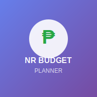

# NR BUDGET Planner 💰

<div align="center">
  
  <h1>NR BUDGET Planner</h1>
  <p><strong>Smart Personal Finance Management System</strong></p>
  <p>Track income, expenses, savings, and bills with powerful analytics and forecasting</p>
  
  [](https://php.net)
  [](https://mysql.com)
  [](https://getbootstrap.com)
  [](https://chartjs.org)
</div>

---

## 🚀 Features

### 💳 **Multi-User System**
- Secure user registration with admin approval
- Individual PIN-based authentication
- User-specific data isolation

### 📊 **Comprehensive Budget Management**
- Monthly budget planning and tracking
- Income sources management
- Detailed expense categorization
- Actual vs. budgeted expense comparison

### 💰 **Advanced Financial Tracking**
- Real-time expense recording
- Payment method tracking (Cash, Credit Card, Online, Savings)
- Savings account management
- Quick actions for daily expenses

### 📅 **Bill & Subscription Management**
- Due date tracking for bills and subscriptions
- Overdue and upcoming bill notifications
- Payment status tracking
- Bill type categorization (Utilities, Subscriptions, Credit Cards, etc.)

### 📈 **Analytics & Forecasting**
- Monthly financial reports
- Previous month, current month, and next month forecasting
- Interactive charts and graphs
- Savings progress tracking

### 📱 **Mobile-First Design**
- Responsive Bootstrap 5.3 interface
- Mobile-optimized navigation
- Touch-friendly controls
- Clean, modern UI

---

## 🛠️ Technology Stack

- **Backend**: PHP 8.2+
- **Database**: MySQL 8.0+
- **Frontend**: Bootstrap 5.3, Chart.js 4.0+
- **Icons**: Font Awesome 6.0
- **Security**: PIN-based authentication with hashing
- **URLs**: Clean URL routing with .htaccess support

---

## 📋 Prerequisites

Before you begin, ensure you have the following installed:
- PHP 8.2 or higher
- MySQL 8.0 or higher
- Web server (Apache/Nginx) or PHP development server
- Composer (optional, for dependency management)

---

## 🚀 Installation

### 1. Clone the Repository
```bash
git clone https://github.com/nakerz99/budget-and-expenses-tracker.git
cd budget-and-expenses-tracker
```

### 2. Database Setup
```bash
# Create a new MySQL database
mysql -u root -p
CREATE DATABASE budget_planner;
USE budget_planner;

# Import the database schema
mysql -u root -p budget_planner < database.sql
```

### 3. Configuration
```bash
# Copy and edit the database configuration
cp config/database.example.php config/database.php
# Edit config/database.php with your database credentials
```

### 4. Start the Application

#### Option A: PHP Development Server (Recommended for Development)
```bash
php -S localhost:8001 -t . router.php
```

#### Option B: Apache/Nginx
1. Configure your web server to point to the project directory
2. Ensure mod_rewrite is enabled for Apache
3. Access the application via your web browser

### 5. Initial Setup
1. Visit `http://localhost:8001/register` to create the first admin account
2. The first registered user automatically becomes an admin
3. Login with your credentials and start managing your budget!

---

## 📖 Usage Guide

### 🔐 Authentication
- **Registration**: Create a new account with username, email, password, and 6-digit PIN
- **Login**: Use your username and PIN to access the system
- **Admin Approval**: New registrations require admin approval (first user is auto-approved)

### 💰 Managing Your Budget
1. **Set Up Monthly Budget**: Create a new monthly budget from the Monthly Budget page
2. **Add Income Sources**: Define your income sources and amounts
3. **Plan Expenses**: Categorize and budget your expected expenses
4. **Track Actual Spending**: Record your actual expenses as they occur
5. **Monitor Progress**: Use the dashboard and analytics to track your financial health

### 📅 Bill Management
- **Add Bills**: Mark expenses as bills with due dates
- **Track Due Dates**: View upcoming and overdue bills
- **Update Payments**: Mark bills as paid and track payment methods

### 💾 Savings Tracking
- **Create Savings Accounts**: Set up multiple savings accounts
- **Track Progress**: Monitor your savings goals
- **Automatic Calculations**: System calculates savings based on income vs. expenses

---

## 🗄️ Database Schema

### Core Tables
- `users` - User accounts and authentication
- `months` - Monthly budget periods
- `weeks` - Weekly tracking periods
- `income_sources` - Income categories and amounts
- `expenses` - Budgeted expenses and categories
- `actual_expenses` - Recorded actual spending

### Supporting Tables
- `security_pin` - User PIN authentication
- `payment_methods` - Payment method tracking
- `savings_accounts` - Savings account management
- `quick_actions` - Quick expense recording
- `notifications` - System notifications
- `categories` - Expense categories

---

## 🎨 UI/UX Features

### 📱 Responsive Design
- Mobile-first approach with Bootstrap 5.3
- Collapsible navigation for mobile devices
- Touch-friendly buttons and controls
- Optimized layouts for all screen sizes

### 🎯 User Experience
- Clean, intuitive interface
- Consistent design language
- Clear visual hierarchy
- Helpful tooltips and guidance

### 📊 Data Visualization
- Interactive charts with Chart.js
- Color-coded financial data
- Progress indicators
- Trend analysis graphs

---

## 🔒 Security Features

### 🔐 Authentication
- PIN-based authentication system
- Secure password hashing
- Session management
- Admin approval workflow

### 🛡️ Data Protection
- Input sanitization and validation
- SQL injection prevention
- XSS protection
- CSRF protection

### 👥 Multi-User Security
- User data isolation
- Role-based access control
- Secure admin functions
- Audit trail for approvals

---

## 📱 Mobile Testing

The application has been tested and optimized for:
- ✅ iPhone (iOS 14+)
- ✅ Android (Android 10+)
- ✅ iPad/Tablet devices
- ✅ Desktop browsers (Chrome, Firefox, Safari, Edge)

### Mobile-Specific Features
- Responsive navigation with hamburger menu
- Touch-optimized form controls
- Swipe-friendly tables
- Mobile-optimized modals and dialogs

---

## ⚡ Performance

### Optimization Features
- Efficient database queries
- Optimized CSS and JavaScript
- Compressed assets
- Caching strategies

### Best Practices
- Clean URL routing
- Minimal HTTP requests
- Optimized images
- Progressive enhancement

---

## 🔄 Recent Updates

### v2.0.0 - Multi-User & Enhanced Features
- ✅ Multi-user system with admin approval
- ✅ Bill and subscription tracking
- ✅ Enhanced mobile responsiveness
- ✅ Clean URL routing
- ✅ Improved analytics and forecasting
- ✅ Payment method tracking
- ✅ Savings account management

### v1.5.0 - Mobile Optimization
- ✅ Mobile-first responsive design
- ✅ Touch-friendly interface
- ✅ Optimized navigation
- ✅ Mobile-specific styling

### v1.0.0 - Core Features
- ✅ Basic budget management
- ✅ Income and expense tracking
- ✅ Monthly analytics
- ✅ PIN-based authentication

---

## 🤝 Contributing

1. Fork the repository
2. Create a feature branch (`git checkout -b feature/AmazingFeature`)
3. Commit your changes (`git commit -m 'Add some AmazingFeature'`)
4. Push to the branch (`git push origin feature/AmazingFeature`)
5. Open a Pull Request

---

## 📄 License

This project is licensed under the MIT License - see the [LICENSE](LICENSE) file for details.

---

## 👨‍💻 Author

**Nakerz99**
- GitHub: [@nakerz99](https://github.com/nakerz99)
- Project: [NR BUDGET Planner](https://github.com/nakerz99/budget-and-expenses-tracker)

---

## 🙏 Acknowledgments

- Bootstrap team for the amazing UI framework
- Chart.js for beautiful data visualization
- Font Awesome for the comprehensive icon library
- PHP community for the robust backend framework

---

<div align="center">
  <p><strong>NR BUDGET Planner</strong> - Take control of your finances today! 💰</p>
  <p>Made with ❤️ by Nakerz99</p>
</div>
